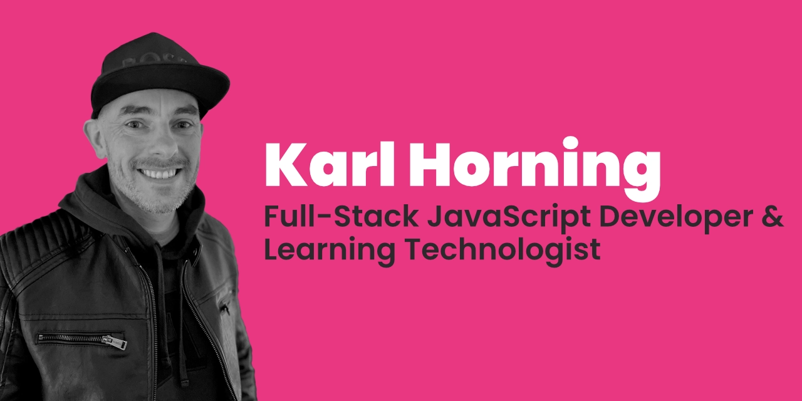

# Hello there! I'm Karl 👋

I'm a **full-stack JavaScript developer and learning technologist** who loves building better digital learning experiences through code and collaboration.

---

## 🧑‍💻 About Me

I'm a self-taught full-stack developer and learning technologist with **over 15 years** of experience bridging education and software engineering across the UK and EU. I combine my hands-on development skills with insights into pedagogy to create scalable, user-centric digital learning platforms.

Currently, I work at **Imperial College London**, where I'm driving the rollout of a unified [learning management system (LMS)](https://www.imperial.ac.uk/about/education/our-projects/learning-management-system/). I collaborate across faculties, write user stories, test APIs, and shape training strategies to ensure that technology truly serves educators and learners.

Before that, I enhanced a global EdTech LMS that supported **over 700,000 users**. I optimised GraphQL APIs, automated tests, and delivered high-availability systems that learners worldwide rely on every day.

When I'm not coding, I enjoy building apps and automation tools with JavaScript and Python. I'm always looking for ways to improve digital access and user experience.

---

## 🛠️ Tech Stack I Enjoy Working With

- 🖥️ **Languages & Frameworks:** Node.js, JavaScript (ES6+), TypeScript, React, Next.js, Python, Electron  
- 🗄️ **Databases & APIs:** PostgreSQL, MongoDB, GraphQL, REST APIs, Sequelize, Prisma  
- 🧪 **Testing & Tools:** Postman, Mocha, API testing, Swagger, Agile workflows  
- 🔧 **Dev & Collaboration:** Git/GitHub, CI/CD, Scrum/Kanban, Confluence, Markdown  
- 🎓 **Education Tech:** Blackboard Ultra, Brightspace, Canvas, Moodle; LMS evaluation & API testing

---

## 🔗 Connect with Me

- 🗂️ [Portfolio](https://karl-horning.github.io/)
- 💼 [LinkedIn](https://www.linkedin.com/in/karl-horning/)
- 🐙 [GitHub](https://github.com/Karl-Horning)
- ✍️ [CodePen](https://codepen.io/karlhorning)

---

## 🌟 Selected Highlights

- Led API testing and identity integration across major LMS platforms at Imperial College London.
- Reduced redundant GraphQL API calls by 10x and implemented rate limiting to improve stability in a global EdTech LMS serving 700k+ users.
- Automated backend testing fully, replacing manual efforts with Postman and Mocha.
- Built Python and Electron automation tools saving teams hours daily by streamlining reporting and onboarding processes.
- Delivered training and documentation to cross-functional teams and educators, bridging technical solutions with real user needs.

---

If you're interested in learning more about my work, feel free to check out my repositories or reach out! I'm always eager to collaborate on projects that enhance education through innovative technology.
